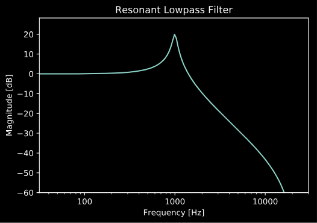

EQ Filter Design
================

Basic Filter Design
-------------------

`audio_dspy` currently contains simple filter design functions
for 6 common EQ shapes:

* Lowpass (1st-order, 2nd-order, Nth-order)
* Highpass (1st-order, 2nd-order, Nth-order)
* Lowshelf
* Highshelf
* Bell
* Notch

As an example, we'll use these functions to design a resonant
2nd-order lowpass filter.

.. code-block:: python
    import audio_dspy as adsp
    fs = 44100 # set sample rate
    b, a = adsp.design_LPF2(1000, 10, fs)
    adsp.plot_magnitude_response(b, a, fs=fs)

    # plot settings
    import matplotlib.pyplot as plt
    plt.title('Resonant Lowpass Filter')
    plt.ylim(-60)
    plt.show()

