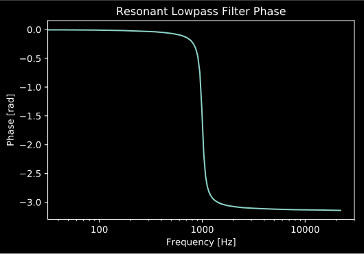
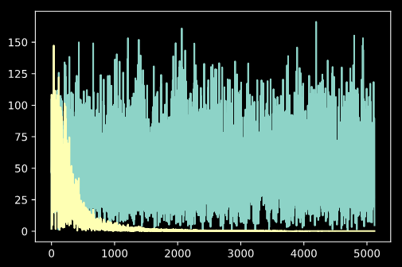
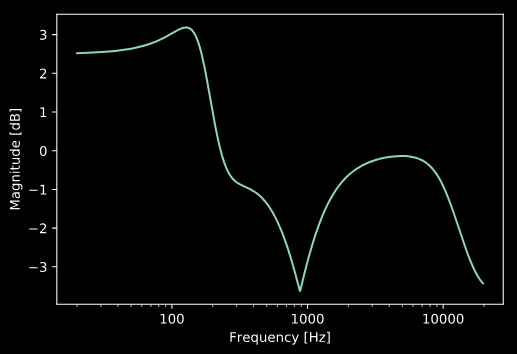

EQ Filter Design
================

.. sectionathor:: Jatin Chowdhury

Basic Filter Design
-------------------

:code:`audio_dspy` currently contains simple filter design functions
for 6 common EQ shapes:

* Lowpass (1st-order, 2nd-order, Nth-order)
* Highpass (1st-order, 2nd-order, Nth-order)
* Lowshelf
* Highshelf
* Bell
* Notch

As an example, we'll use these functions to design a resonant
2nd-order lowpass filter.

.. code-block:: python

    import audio_dspy as adsp
    fs = 44100 # set sample rate
    b, a = adsp.design_LPF2(1000, 10, fs)
    adsp.plot_magnitude_response(b, a, fs=fs)

    # plot settings
    import matplotlib.pyplot as plt
    plt.title('Resonant Lowpass Filter')
    plt.ylim(-60)
    plt.show()

.. image:: ../examples/lowpass.png
  :width: 400

We can also easily view the phase response of the filter:

.. code-block:: python

    adsp.plot_phase_response(b, a, fs=fs)
    plt.title('Resonant Lowpass Filter Phase')
    plt.show()

Processing Audio with Filters
-----------------------------

The filter coefficients returned by the filter design functions can then be
used to filter data. The simplest way to do this is to use the scipy function
:code:`scipy.signal.lfilter()`, however if you prefer a little more
functionality, you can use the :code:`adsp.Filter` object.

As an example, let us design a lowpass filter, to filter a white noise
signal.

.. code-block:: python

    # generate white noise signal
    import numpy as np
    N = 1024
    x = np.random.rand(N) * 2 - 1 # range: (-1, 1)

    # Design filter
    import audio_dspy as adsp
    fs = 44100
    b, a = adsp.design_LPF2(1000, 0.707, fs)

    # Setup filter
    filter = adsp.Filter(2, fs)
    filter.set_coefs(b, a)

    # Process audio
    filter.reset()
    y = filter.process_block(x)

Now we can examine the fft of the input and output signals, and see the
effects of the filtering:

.. code-block:: python

    plt.plot(np.abs(np.fft.rfft(x)))
    plt.plot(np.abs(np.fft.rfft(y)))
    plt.show()

Be sure to call :code:`Filter.reset()` in between filtering independent streams
of data to clear the state of the filter.

Designing and Using an EQ
-------------------------

For more advanced filtering needs, we can use the :code:`adsp.EQ` object.
This object allows us to filter a signal with a whole set of filters.

In the example below, we design an EQ with a low shelf filter, a lowpass
filter, and a notch filter.

.. code-block:: python

    import audio_dspy as adsp
    import numpy as np
    import matplotlib.pyplot as plt

    fs = 44100 # sample rate
    worN = np.logspace(1, 3.3, num=1000, base=20) # frequencies to plot

    # design EQ
    eq = adsp.EQ(fs)
    eq.add_LPF(10000, 0.707)
    eq.add_lowshelf(200, 1.4, 2)
    eq.add_notch(880, 0.707)

    # plot EQ magnitude response
    eq.plot_eq_curve(worN=worN)
    plt.show()

Note that you can process audio with the EQ object, just like the Filter object
using :code:`adsp.EQ.process_block()` and :code:`adsp.EQ.reset()`.
