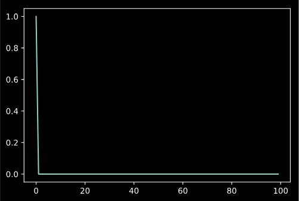
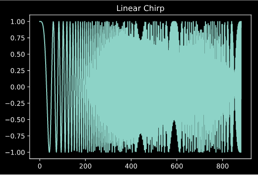
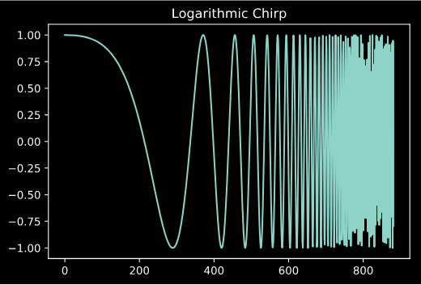
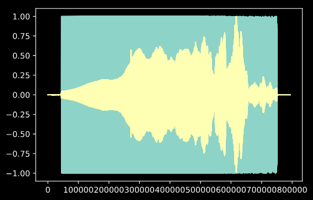
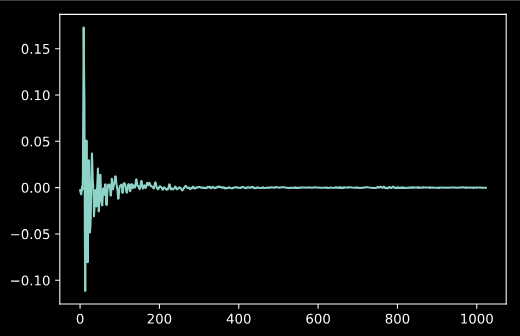
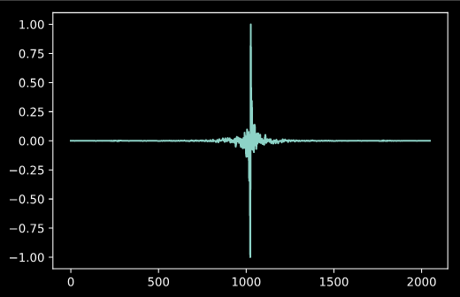
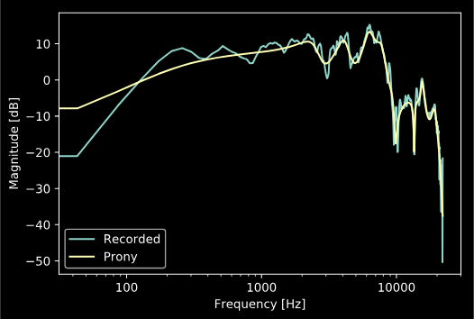

Impulse Response Tools
======================

.. sectionathor:: Jatin Chowdhury

Generating Signals for Recording IRs
------------------------------------

To generate an impulse signal, we can use :code:`adsp.impulse()`.

.. code-block:: python

    import audio_dspy as adsp
    delta = adsp.impulse(100)

    # plot the impulse
    import matplotlib.pyplot as plt
    plt.plot(delta)

Often a better base signal for recording impulse responses is a sine sweep
or "chirp" signal. Recording IRs with a chirp can result in a significantly
better signal-to-noise ratio than a raw impulse. :code:`audio_dspy` has
functions for generating both linear and logarithmic chirps.

.. code-block:: python

    import audio_dspy as adsp
    chirp_lin = adsp.sweep_lin(0.02, 44100)
    chirp_log = adsp.sweep_log(20, 20000, 0.02, 44100)

    import matplotlib.pyplot as plt
    plt.figure()
    plt.plot(chirp_lin)
    plt.title('Linear Chirp')

    plt.figure()
    plt.plot(chirp_log)
    plt.title('Logarithmic Chirp')

Manipulating a Recorded IR
--------------------------

Now let's assume that you have generated a sine sweep, and recorded the
sine sweep response of a room. You can now use :code:`adsp.sweep2ir()`
to convert your recording into an impulse response.

.. code-block:: python

    fs, dry_sweep = get_sweep_dry()
    import matplotlib.pyplot as plt
    fs, sweep = get_sweep_response()
    plt.plot(dry_sweep)
    plt.plot(sweep)

.. code-block:: python

    import audio_dspy as adsp
    h = adsp.sweep2ir(dry_sweep, sweep)
    plt.plot(h[:1024])

We can now convert this impulse response into a linear phase filter:

.. code-block:: python

    h_lin = adsp.tf2linphase(h)
    plt.plot(h_lin)

or a minimum phase filter:

.. code-block:: python

    h_min = adsp.tf2minphase(h)

Prony's Method
--------------

:code:`audio_dspy` also provides functions for creating an IIR filter with an
optimally similar transfer function to the recorded impulse response, using
Prony's Method.

.. code-block:: python

    b, a = adsp.prony(h, 20, 20)
    adsp.plot_magnitude_response(h, [1], fs=fs)
    adsp.plot_magnitude_response(b, a, fs=fs)

    plt.legend(['Recorded', 'Prony'])

