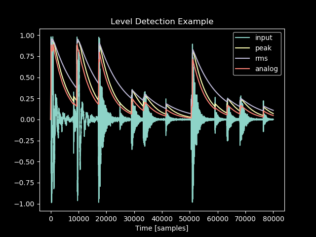

Level Detection
===============

:code:`audio_dspy` has support for audio level detection, similar
to what might be used for a compressor, limiter, gate, or other
similar dynamics processor.

Processing Audio
----------------

Processing audio through a level detector can be implemented as
follows:

.. code-block:: python

    from scipy.io import wavfile
    fs, x = wavfile.read('drums.wav')
    x = adsp.normalize(x[:,0])
    plt.plot(x, label='input')

    for mode in ['peak', 'rms', 'analog']:
        y = adsp.level_detect(x, fs, mode=mode)
        plt.plot(y, label=mode)

    plt.title('Level Detection Example')
    plt.xlabel('Time [samples]')
    plt.legend()

