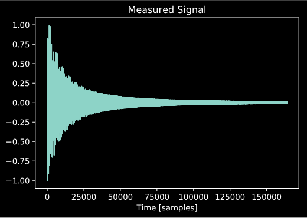
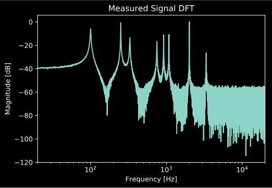
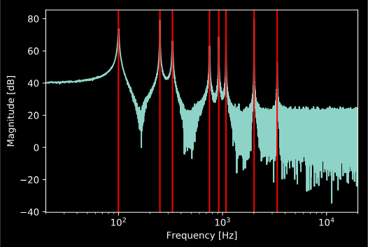
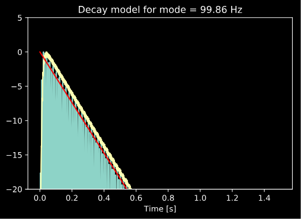
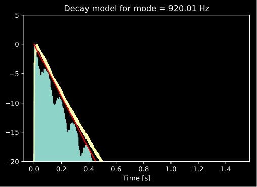
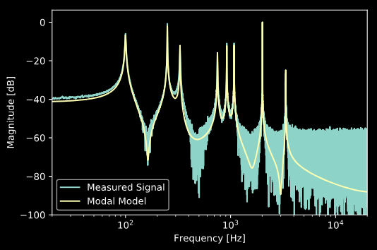

Modal Modelling Tutorial
========================

.. sectionathor:: Jatin Chowdhury

In this tutorial, we will show how to use :code:`audio_dsp` to generate a
modal model of a measured signal. To begin, we will examine a test signal
recorded from a carrilon bell.

.. code-block:: python

    import numpy as np
    import matplotlib.pyplot as plt
    import audio_dspy as adsp

    plt.figure()
    plt.plot(x)
    plt.title('Measured Signal')
    plt.xlabel('Time [samples]')

    plt.figure()
    X = adsp.normalize(np.fft.rfft(x))
    f = np.linspace (0, _fs_/2, num=len(X))
    plt.semilogx(f, 20 *  np.log10 (np.abs(X)))
    plt.xlim(20, 20000)
    plt.title('Measured Signal DFT')
    plt.xlabel('Frequency [Hz]')
    plt.ylabel('Magnitude [dB]')

We know this signal is a good candidate for modal modelling, since the
resonant frequencies don't appear to be harmonically related. If they were,
a different approach, such as additive synthesis might be a better choice.
We could simply construct an impulse response model of the bell, but as we
can see our measurement is quite noisy, which would make our IR model noisy
as well.

Finding the Mode Frequencies
----------------------------

We can use :code:`adsp.find_freqs()` to find the mode frequencies.

.. code-block:: python

    freqs, peaks = adsp.find_freqs(sig, _fs_, above=80, plot=True)
    plt.xlim(20, 20000)

Note that the parameters used for this function depend greatly on
the signal being analyzed, and you may need to fine tune them to
achieve best results.

Finding the Mode Decay Rates
----------------------------

We can now find the decay rates of the modes using
:code:`adsp.find_decay_rates()`.

.. code-block:: python

    taus = adsp.find_decay_rates(freqs, sig[:int(_fs_*1.5)], _fs_, 30, thresh=-10, plot=True)

Note that if the :code:`plot` flag is set, the function will
produce a decay model plot for every mode, though we only choose
to show two of them here in this tutorial. Also note that, again,
the optimal parameters of the function will vary greatly depending
on the data being analyzed.

Finding the Mode Amplitudes
----------------------------

If you like, you can simply use the peaks generated by the
:code:`adsp.find_freqs()` function as the amplitudes of your
modal model. However, doing this ignores the phase variations
that the different modes may have, as well as other spectral
characteristics perhaps not captured by the modes. To create a
more accurate model, we can use least squares optimization to
find the optimal amplitude and phase of each mode with the
:code:`adsp.find_complex_amplitudes()` function.

.. code-block:: python

    amps = adsp.find_complex_amplitudes (freqs, taus, _N_, sig, _fs_)

And finally, we can use :code:`adsp.generate_modal_signal()` to
generate our modal model, and compare with the measured signal:

.. code-block:: python

    y = adsp.generate_modal_signal(amps, freqs, taus, len(amps), _N_, _fs_)

    Y = adsp.normalize(np.fft.rfft (y))
    plt.semilogx (f, 20 * np.log10 (np.abs (X)))
    plt.semilogx (f, 20 * np.log10 (np.abs (Y)))
    plt.xlim(20, 20000)
    plt.ylim(-100)
    plt.legend(['Measured Signal', 'Modal Model'])
    plt.xlabel('Frequency [Hz]')
    plt.ylabel('Magnitude [dB]')

.. rubric:: References

.. [1] K.J. Werner, E.K. Canfield-Dafilou "Modal Audio Effects: A Carollon Case Study",
    Proc. of the 20th International Conference on Digital Audio Effects (DAFx-17),
    Edinburgh, UK, Sept. 5-9, 2017
