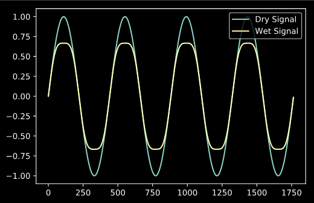
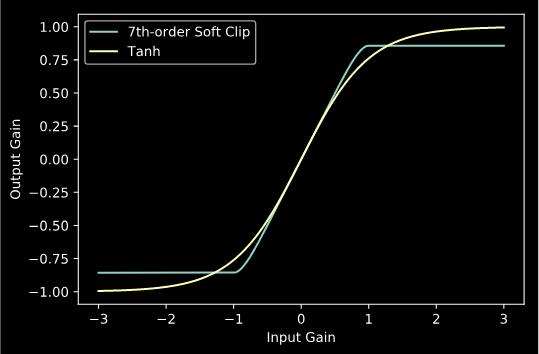
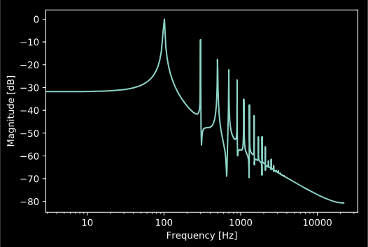

Nonlinear Processing
====================

:code:`audio_dspy` currently supports three simple nonlinear processors
(hard-clipping, soft-clipping, and dropout nonlinearities), as well as useful
plotting functions for visualizing the properties of a nonlinear system.

Processing Audio
----------------

Processing a block of audio with a nonlinear processor can be done
as follows:

.. code-block:: python

    import numpy as np
    import matplotlib.pyplot as plt
    import audio_dspy as adsp

    fs = 44100
    N = 441*4
    freq = 100
    x = 1.0 * np.sin(2 * np.pi * np.arange(N) * freq / fs)
    y = adsp.soft_clipper(x)

    plt.plot(x)
    plt.plot(y)
    plt.legend(['Dry Signal', 'Wet Signal'])

Visualizing Nonlinear Functions
-------------------------------

To visualize a nonlinear function, you can pass a lambda of the function
into :code:`adsp.plot_static_curve()`, or for nonlinear functions with
more dynamic responses, :code:`adsp.plot_dynamic_curve()`.

.. code-block:: python

    import numpy as np
    import matplotlib.pyplot as plt
    import audio_dspy as adsp

    adsp.plot_static_curve(lambda x :  adsp.soft_clipper(x, deg=7), gain=3)
    adsp.plot_static_curve(lambda x :  np.tanh(x), gain=3)
    plt.legend (['7th-order Soft Clip', 'Tanh'])

We can also plot the harmonic response of a nonlinear function with
:code:`adsp.plot_harmonic_response()`.

.. code-block:: python

    adsp.plot_harmonic_response(lambda x : np.tanh(x), gain=5

